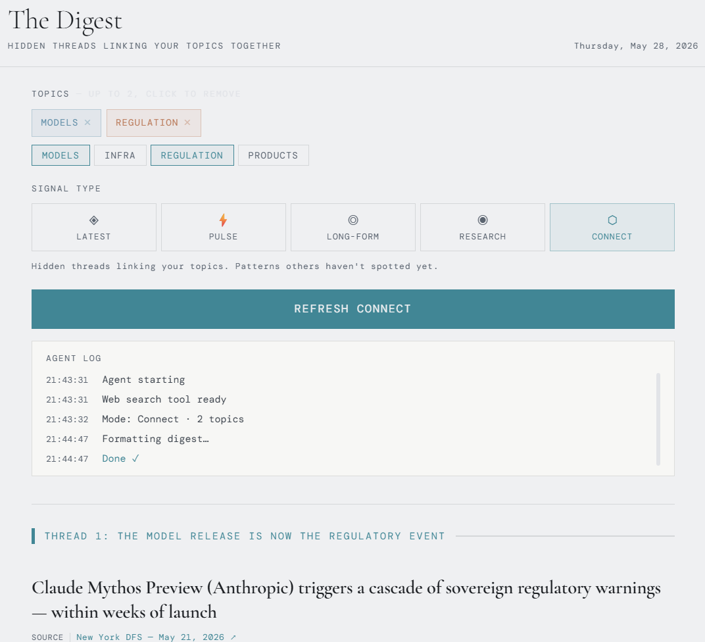

# The Digest

An AI news agent built with Next.js and Claude. Pick topics, pick a signal type, and get a structured briefing backed by live web search — in seconds.

A good starter project if you're learning to build with the Anthropic API.

---



---

## What it does

Choose up to five topics (e.g. "Models", "Regulation", "Infra") and one of five signal types:

| Signal | What you get |
|--------|-------------|
| **Latest** | Breaking news from the last 48 hours, with named sources and why each story matters |
| **Pulse** | Trending GitHub repos and Hacker News discussions gaining momentum right now |
| **Long-form** | Substacks and essays worth reading — arguments and ideas, not headlines |
| **Research** | Recent papers from arxiv and academic journals, last 30 days |
| **Connect** | Hidden threads linking your topics together — patterns others haven't spotted |

Every story has a source link and an **explain simply** button that rephrases it in plain English.

Live demo: [ai-news-agent-gules.vercel.app](https://ai-news-agent-gules.vercel.app)

---

## Quick start

You'll need [Node.js](https://nodejs.org) (LTS) and an Anthropic API key.

**Get an API key**

Sign up at [console.anthropic.com](https://console.anthropic.com), add a payment method, then create a key under **API Keys**. It starts with `sk-ant-api03-`. A typical digest run costs a few cents, set a spending cap under **Billing → Usage limits** before you share the URL with anyone.

**Run locally**

```bash
git clone https://github.com/YOUR-USERNAME/ai-news-agent.git
cd ai-news-agent
npm install
```

Create `.env.local` in the project root (see `.env.example` for reference):

```
ANTHROPIC_API_KEY=sk-ant-api03-...
NEXT_PUBLIC_MULTI_USER=false
```

```bash
npm run dev
```

Open [localhost:3000](http://localhost:3000).

---

## Deploy to Vercel

This repo includes a Claude Code skill that walks you through the full deployment step by step, Anthropic key, env vars, and first deploy.

If you have [Claude Code](https://claude.ai/code) installed, run this inside the project:

```
/deploy
```

Or follow the manual steps in [`.claude/skills/deploy/SKILL.md`](.claude/skills/deploy/SKILL.md).

---

## What you can learn from this code

This is a deliberately small codebase, around 600 lines across a handful of files. It's a good place to see how a few Claude API patterns work end to end:

**Tool use with web search** `app/api/digest/route.js` shows how to give Claude the `web_search` tool and let it decide when to use it. The response comes back as a mixed array of `text` and `tool_use` blocks, which the frontend parses.

**Two models for two jobs** the digest uses Claude Sonnet 4.6 (capable, slower) while the "explain simply" button uses Claude Haiku 4.5 (fast, cheap). Matching model to task keeps costs low without sacrificing quality where it matters.

**System prompt engineering** each of the five signal types has its own system prompt in `components/NewsDigestAgent.jsx`. Reading them side by side shows how prompt structure shapes output structure.

**Next.js App Router API routes** `app/api/digest/route.js` and `app/api/explain/route.js` are minimal examples of server-side API routes that call an external service and return JSON. The API key stays on the server and is never exposed to the browser.

---

## Built with

- [Next.js](https://nextjs.org) App Router, React 19
- [Anthropic SDK](https://github.com/anthropics/anthropic-sdk-node) Claude Sonnet 4.6 (digest) and Claude Haiku 4.5 (explanations)
- [Vercel](https://vercel.com) hosting

---

MIT licence · Built by [Martina Edwards](https://martina-edwards.vercel.app)
